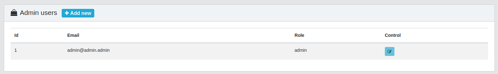
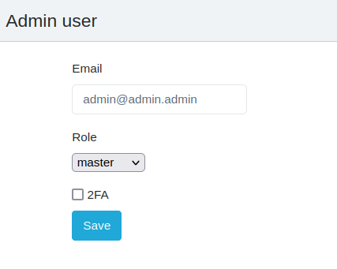
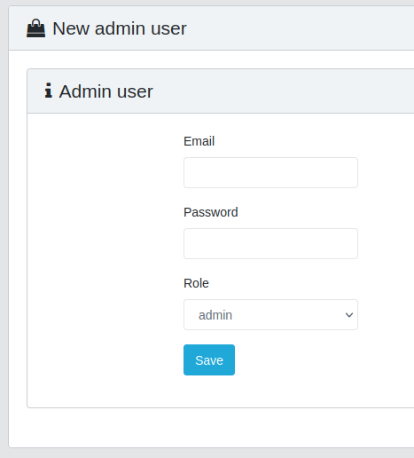

Admin Users
===================================

In this section, you can create and edit administrators of the Management console.
All information about administrators is presented in the section table:

- **id** - unique identifier of the administrator
- **email** - administrator email
- **role** - administrator role. Role types: admin, manager, compliance
- **control** - available interactions with the administrator account. The button opens the account editing form. In the editing form, you can change the administrator's email and his role.

Adding new admin user
---------------------------------

The functionality of adding an administrator account is implemented by pressing the "+ Add New" button, which opens the form for creating a new administrator.

The form for adding an administrator contains the following fields:
- Email - administrator email (also login)
- Password - password for the administrator account
- Role - role (describe differences)

To save the new administrator account, click on the "Safe" button. As soon as the save is completed, the new account will be available for work. It will have all the functionality available for his role.
