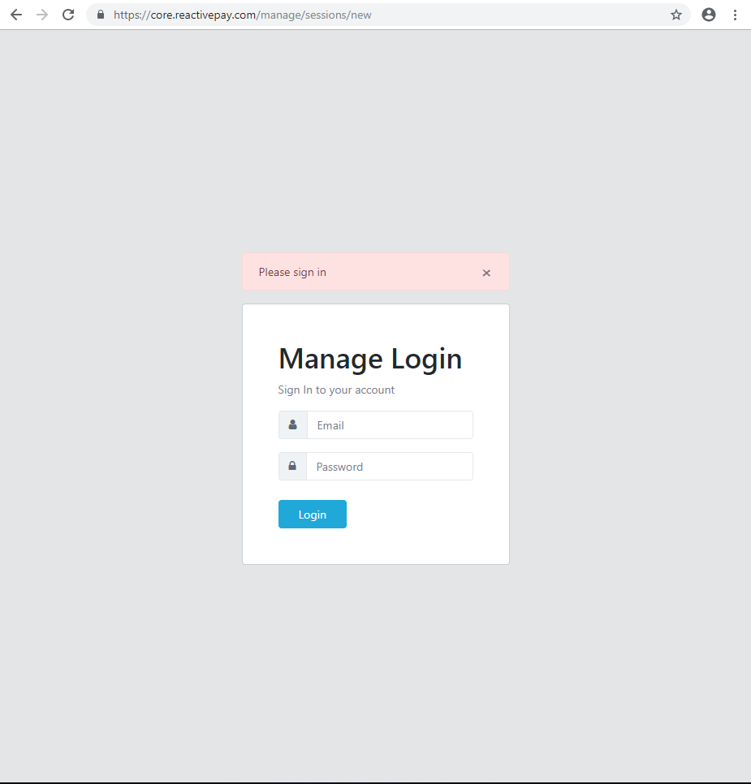

Management console
===================================
Management console is an administration system integrated with reactivepay services. This system provides functionality for managing various elements of the reactivepay system, such as creating merchants or viewing various statistics.

Access to the Management console is carried out through the login at core.reactivepay.com/manage/

The Management Console is divided into sections representing the relevant functionality. Section List:

- Admin Users
- Merchant settements
- Merchants
- Profiles
- Disputes
- Charge requests
- Payins/Payouts
- Payment Requests

Contents
--------

.. toctree::

adminuser
